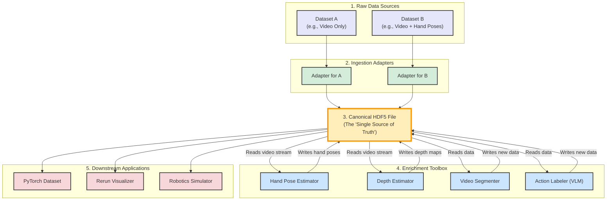

# Egohub Architectural Plan & Development Checklist

This document outlines the architectural vision for `egohub` and serves as a development checklist to track progress. The goal is to create a flexible, modular, and extensible system for ingesting, enriching, and utilizing egocentric robotics data.

## Core Principle: The Hub-and-Spoke Model

Instead of a simple linear pipeline, we adopt a "hub-and-spoke" model. The central "hub" is our canonical HDF5 file, which acts as a single source of truth for a given data sequence. A suite of "spokes" connect to this hub, representing ingestion adapters, data enrichment tools, and downstream applications.

*See the diagram below for a visual representation.*

---

## Development Checklist

### Phase 1: Core Infrastructure & Ingestion

- [x] **Canonical Data Schema:** Define a clear, extensible HDF5 schema (`egohub/schema.py`).
- [x] **Coordinate System Standardization:** Establish a canonical world coordinate frame (Z-up) and transformation utilities (`egohub/transforms/coordinates.py`).
- [x] **HDF5 Container:** Implement the "hub" using HDF5 for data storage.
- [x] **Ingestion Adapter Framework:** Create a pattern for data converters in `scripts/adapters/`.
- [x] **Implement EgoDex Adapter:** Build a complete adapter for the EgoDex dataset.
- [x] **Adapter Validation Checklist:** Add a console report to adapters to show what data was found vs. missing.
- [ ] **Generic Video Adapter:** Create a simple adapter to ingest raw `.mp4` or other video files into the `rgb/` group of a new HDF5 file.

### Phase 2: Enrichment Toolbox (`scripts/tools/`)

- [ ] **Tooling Framework:** Establish the pattern for an enrichment tool that reads/writes to the same HDF5 file.
- [ ] **Tool: Depth Estimation:**
    - [ ] Create `scripts/tools/estimate_depth.py`.
    - [ ] Integrate a monocular depth estimation model (e.g., from `torch.hub`).
    - [ ] Read RGB video from HDF5, generate depth maps, and write back to `depth/image`.
- [ ] **Tool: Hand Pose Estimation:**
    - [ ] Create `scripts/tools/generate_hand_poses.py`.
    - [ ] Integrate a hand tracking model (e.g., MediaPipe Hands).
    - [ ] Read RGB video, generate hand poses, and write back to `hands/.../pose_in_world`.
- [ ] **Tool: Action Labeling (VLM):**
    - [ ] Create `scripts/tools/label_actions.py`.
    - [ ] Integrate a Vision Language Model.
    - [ ] Analyze video frames and write descriptive labels to `metadata/action_label`.

### Phase 3: Application & Export Layer

- [x] **PyTorch Dataset Loader:** Create and maintain `egohub.datasets.EgocentricH5Dataset` for easy data loading.
- [x] **Rerun Exporter:** Create a visualization and validation script in `scripts/exporters/export_to_rerun.py`.
- [ ] **Robotics Simulator Exporter:**
    - [ ] Plan a data format suitable for a target simulator (e.g., Isaac Sim).
    - [ ] Create `scripts/exporters/export_to_isaac_sim.py`.

---

## Architectural Diagram

## Component Breakdown

### 1. The Central HDF5 Hub (`.h5` file)
- This is the single, canonical data container for a given sequence.
- When a new dataset is ingested, the adapter creates an HDF5 file that is as complete as the source data allows. The validation checklist within the adapter will report what is present and what is missing.

### 2. Ingestion Adapters (`scripts/adapters/`)
- **Purpose:** To convert raw, heterogeneous dataset formats into our canonical HDF5 structure.
- **Responsibility:** These scripts are responsible *only* for format conversion and coordinate system alignment. They do not generate or infer new data.
- **Example:** `adapter_egodex.py` converts EgoDex data. An `adapter_video.py` could be created to handle raw video files.

### 3. The Enrichment Toolbox (`scripts/tools/`)
- **Purpose:** To add new data streams to an *existing* canonical HDF5 file.
- **Workflow:** Each tool is a standalone script that takes an `.h5` file path as both input and output. It reads existing data (e.g., RGB video), processes it, and writes a new data stream (e.g., depth maps) back into the same file.
- **Examples of Tools:**
  - **`estimate_depth.py`**: Reads RGB video, runs a monocular depth estimation model, and saves the resulting depth maps to `depth/image`.
  - **`generate_hand_poses.py`**: Reads RGB video and saves `hands/left/pose_in_world` and `hands/right/pose_in_world`.
  - **`label_actions.py`**: Uses a Vision Language Model (VLM) to analyze video frames and generate human-readable action labels, saving them to `metadata/action_label`.
  - **`segment_video.py`**: Performs semantic or instance segmentation and saves the results.

### 4. Downstream Applications
- These are the final consumers of the fully enriched canonical data.
- **Examples:**
  - **`egohub.datasets.EgocentricH5Dataset`**: Our PyTorch dataset for loading data for model training.
  - **`scripts/exporters/`**: Scripts like `export_to_rerun.py` for visualization and validation.
  - Future simulators or robotics environments that can directly consume the `.h5` files.

## Advantages of this Architecture
- **Modularity:** Each component has a single, well-defined responsibility.
- **Extensibility:** Adding a new dataset requires only a new adapter. Adding a new capability requires only a new tool.
- **Flexibility:** Users can create custom pipelines by chaining different tools together based on their needs.
- **Clarity:** The state of any dataset is transparently stored in the HDF5 file, and can be inspected at any stage of the enrichment process. 