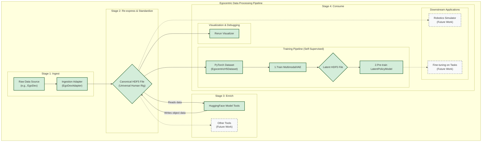

<div align="center">
  <pre>
┌─┐┌─┐┌─┐┬ ┬┬ ┬┌┐ 
├┤ │ ┬│ │├─┤│ │├┴┐
└─┘└─┘└─┘┴ ┴└─┘└─┘</pre>
</div>

An end-to-end Python pipeline for ingesting, normalizing, and serving egocentric datasets for humanoid robotics research in a unified state and action format.

[DeepWiki Link](https://deepwiki.com/IstariRobotics/egohub/)

## Architecture


_Completed modules marked in green; future work marked in grey._

## Project Structure

The repository is organized to clearly separate the core library, configuration, and data.

```
egohub/
├── configs/                  # External YAML configurations for adapters (e.g., egodex.yaml)
├── egohub/                   # Core, installable library source code
│   ├── adapters/             # Data ingestion classes (EgoDexAdapter, etc.)
│   │   └── base.py           # Base class that all adapters inherit from.
│   ├── cli/                  # Argparse-based CLI applications.
│   │   ├── main.py           # Main entry point for commands like 'convert'.
│   │   └── process_data.py   # Script to run enrichment Tools on HDF5 files.
│   ├── processing/           # Granular, reusable data processing components.
│   │   ├── hand.py           # Logic for hand pose processing.
│   │   └── video.py          # Logic for video decoding.
│   ├── tools/                # Self-contained data enrichment tools.
│   │   ├── base.py           # Base class for all tools.
│   │   └── hf_tools.py       # Tool(s) using the Hugging Face library.
│   ├── models/               # VAE and Policy models for training.
│   ├── exporters/            # Data exporting classes (RerunExporter, etc.)
│   ├── schema.py             # Canonical HDF5 schema defined with dataclasses.
│   └── ...                   # Other core modules (datasets, training, etc.)
├── tests/                    # Test suite for unit and integration tests.
└── data/                     # Data storage (gitignored).
    ├── raw/                  # For storing original, downloaded datasets.
    └── processed/            # For storing canonical HDF5 files.
```

## Quick Start

### Prerequisites

- Python 3.9+
- `uv` package manager (`brew install uv` on macOS)

### Installation

```bash
# Clone the repository
git clone <repository-url>
cd egohub

# Set up environment and install dependencies
uv venv
source .venv/bin/activate
uv pip install -e ".[dev,full]" # Install with all extras

# Set up pre-commit hooks for automated quality checks
pre-commit install
```

### Developer Workflow

This project uses a suite of tools to ensure code quality and consistency.

1.  **Formatting & Linting**: We use `ruff` for linting and `black` for formatting, run automatically via `pre-commit`.
2.  **Type Checking**: `mypy` is used for static type analysis.

You can run all checks manually at any time:
```bash
# Run all linters and type checkers
make lint
```

To run the core unit tests:
```bash
# Run fast, deterministic unit tests
make test
```

### Usage Workflows

The following steps outline the key workflows supported by the library.

#### 1. Conversion Workflow
Convert a raw dataset (e.g., EgoDex) into the canonical HDF5 format. This is handled by a dedicated `Adapter`.
```bash
egohub convert egodex \
    --raw-dir path/to/raw/EgoDex \
    --output-file data/processed/egodex.h5
```

#### 2. Enrichment Workflow
Apply a processing `Tool` to the canonical HDF5 file to add new data. The example below uses the Hugging Face object detection tool to find objects in the video stream and add them to the file.
```bash
python -m egohub.cli.process_data \
    --input-file data/processed/egodex.h5 \
    --tools HuggingFaceObjectDetectionTool
```

#### 3. Visualization Workflow
At any point, you can visualize the contents of an HDF5 file with Rerun. This is useful for inspecting the original data as well as any data added by enrichment tools.
```bash
egohub visualize data/processed/egodex.h5
```

### End-to-End Example: EgoDex

This example walks through the full pipeline for a single sequence from the EgoDex dataset, from raw data to visualization. 

**1. Data Setup**

First, place your raw EgoDex data into the `data/raw/` directory. The pipeline expects a specific structure. For this example, we'll use the `add_remove_lid` sequence:

```
egohub/
└── data/
    └── raw/
        └── EgoDex/
            └── test/
                └── add_remove_lid/
                    ├── calib/
                    ├── data.json
                    └── video.mp4
```

**2. Convert the Raw Data**

Use the `egohub convert` command to transform the raw data into the canonical `egohub` HDF5 format. We'll process only the first sequence for this test.

```bash
egohub convert egodex \
    --raw-dir data/raw/EgoDex/test/add_remove_lid \
    --output-file data/processed/EgoDex_add_remove_lid.hdf5 \
    --num-sequences 1
```
This creates a new file at `data/processed/EgoDex_add_remove_lid.hdf5`.

**3. Enrich with Object Detections**

Next, run an enrichment tool to add more data to the file. We'll use the `HuggingFaceObjectDetectionTool` to find objects in the video frames. Since this is a test, we will only process the first trajectory in the file.

```bash
python egohub/cli/process_data.py \
    --input-file data/processed/EgoDex_add_remove_lid.hdf5 \
    --tools HuggingFaceObjectDetectionTool
```
**4. Visualize the Enriched Data**

Finally, visualize the file again to see the newly added object bounding boxes.

```bash
egohub visualize data/processed/EgoDex_add_remove_lid.hdf5
```

## Supported Datasets

This table lists the datasets currently supported by `egohub` for ingestion. We welcome contributions for new adapters! See `CONTRIBUTING.md` for a guide on how to add one.

| Dataset Name | CLI Identifier | Adapter Class     | Notes                                                  |
| :----------- | :------------- | :---------------- | :----------------------------------------------------- |
| **EgoDex**   | `egodex`       | `EgoDexAdapter`   | Supports video, camera pose, and hand/skeleton poses. |

Instructions on downoading datasets can be found in `README_DATASETS.md`.

## Supported Tools

This table lists the enrichment tools available for post-processing canonical HDF5 files.

| Tool Name                        | Tool Class                        | Dependencies      | Description                                                                 |
| :------------------------------- | :-------------------------------- | :---------------- | :-------------------------------------------------------------------------- |
| **Hugging Face Object Detector** | `HuggingFaceObjectDetectionTool`  | `torch`, `transformers` | Reads RGB frames, runs inference with a DETR model, and writes bounding boxes to the `objects/` group. |

## Canonical Data Schema

Our canonical HDF5 format is designed to be flexible and extensible. The authoritative definition of the schema is maintained via Python `dataclasses` in `egohub/schema.py`. This ensures that all data created by adapters is consistent.

All spatial data is transformed into a single **right-handed, Z-up** world coordinate frame.

Each HDF5 file can contain multiple trajectories, identified as `trajectory_{:04d}`. Within each trajectory, data is organized into logical groups according to the `Trajectory` dataclass:

| Group Path                      | Dataclass Field      | Description                                                                                                                               |
| :------------------------------ | :------------------- | :---------------------------------------------------------------------------------------------------------------------------------------- |
| **`metadata/`**                 | `metadata: Metadata` | Contains high-level information like `uuid`, `source_dataset`, and a synchronized master `timestamps_ns` dataset.                          |
| **`cameras/{camera_name}/`**    | `cameras: Dict`      | A group for each camera, where `{camera_name}` is a unique identifier (e.g., `ego_camera`). Contains `pose_in_world`, `intrinsics`, and `rgb` data. |
| **`hands/{left,right}/`**       | `hands: Dict`        | Contains data related to hand tracking, such as `pose_in_world` and `pose_indices`.                                             |
| **`skeleton/`** (optional)      | `skeleton: Skeleton` | Stores full-body skeleton tracking data. The skeleton structure is fixed to a canonical 22-joint definition based on SMPL-X (see `egohub/constants.py`), ensuring consistency across all datasets. The group contains `positions`, `confidences`, and `frame_indices`. |

**Note on Extensibility and Temporal Indices:** The base schema is intentionally minimal. Additional data can be added by enrichment **Tools**.

A key feature of the schema is robust temporal synchronization. Every time-varying dataset (e.g., `pose_in_world`) is accompanied by an index dataset (e.g., `pose_indices`). Each value in an index array corresponds to a frame and points to the index of the master `metadata/timestamps_ns` array that provides its timestamp. This design ensures that all data streams can be correctly aligned even if they have different frame rates or dropped frames.

### Coordinate Systems

- **World Frame**: Right-handed, Z-up, Y-forward, X-right (units are in meters).
- **Camera Frame**: Standard OpenCV model (Z-forward, Y-down, X-right).
- **Transformations**: Poses are stored as `T_world_local`, representing the transform from the entity's local frame to the world frame.

## Testing

```bash
# Run all tests
pytest
```

## Pipeline Scope and Future Work

### Contributing

**Architectural Principles**

The `egohub` pipeline is designed around a set of core principles to ensure it is modular, extensible, and easy to maintain. A recent refactoring effort has solidified this architecture.

1.  **Separation of Concerns**: The library is organized into distinct, decoupled components.
    *   **Adapters (`egohub/adapters`)**: Responsible *only* for ingesting raw, dataset-specific data and converting it to the canonical HDF5 format.
    *   **Processing Components (`egohub/processing`)**: Smaller, reusable components that perform a single task, like coordinate transforms or video decoding. Adapters use these components to build their data conversion pipeline.
    *   **Tools (`egohub/tools`)**: Post-processing modules that enrich an *existing* canonical HDF5 file with new data (e.g., running object detection). They are applied via a dedicated CLI script.

2.  **Configuration as Code**: All dataset-specific or environment-specific parameters (e.g., frame rates, camera intrinsics) are externalized into YAML files in the `configs/` directory. Each adapter automatically loads its corresponding config, eliminating hardcoded values and making it easy to add or modify dataset support.

3.  **Schema as the Single Source of Truth**: The structure of the canonical data is formally defined using Python dataclasses in `egohub/schema.py`. This provides a single, unambiguous source of truth for the HDF5 layout, which is used by adapters for writing and can be used for validation.


### What is Supported
- **End-to-End Pre-Training**: A full pipeline from raw EgoDex data to a pre-trained `LatentPolicyModel`.
- **Unified Data Format**: A canonical HDF5 schema that supports multimodal and multi-camera data streams, defined in `egohub/schema.py`.
- **Extensible Tooling**: A system for enriching canonical data with post-processing tools.
- **Rerun.io Visualization**: Built-in support for visualizing the canonical HDF5 data.
- **Two-Stage Training Architecture**: A VAE-based approach to learn a latent representation, followed by self-supervised pre-training of a temporal Transformer model.

### Future Work
- **Downstream Task Fine-Tuning**: While this pipeline produces a pre-trained model, it does not yet include scripts for fine-tuning on specific tasks like imitation learning or reinforcement learning.
- **Additional Data Enrichment**: The architecture is designed for future integration of tools for depth estimation, video segmentation, and automated labeling.
- **Broader Dataset Support**: We welcome contributions of new `Adapters` to support more egocentric datasets like Ego4D, Epic-Kitchens, etc.
- **Robotics Integration**: The ultimate goal is to bridge this data to robotics simulators and real-world hardware, a feature that is still in the planning phase.


