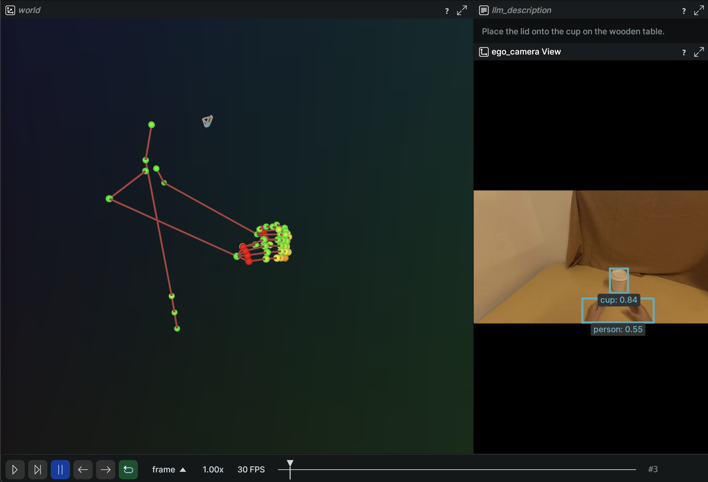
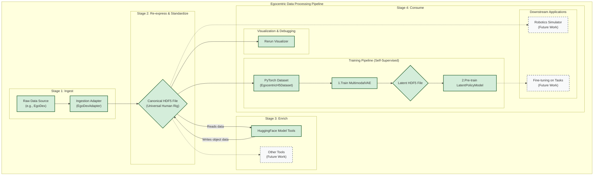

<div align="center">
  <pre>
┌─┐┌─┐┌─┐┬ ┬┬ ┬┌┐ 
├┤ │ ┬│ │├─┤│ │├┴┐
└─┘└─┘└─┘┴ ┴└─┘└─┘</pre>
</div>

# EgoHub

**A comprehensive Python library for processing egocentric human data for robotics research.**

EgoHub provides an end-to-end pipeline for ingesting, normalizing, and serving egocentric datasets in a unified state and action format. Built with modularity and extensibility in mind, it handles the complete workflow from raw data to training-ready formats.

**Core Features**

- **Video Processing**: Multi-camera video ingestion, synchronization, and frame extraction
- **Skeleton Tracking**: Full-body pose estimation using a canonical Mediapipe skeleton (33 body landmarks + 21 hand landmarks per hand, plus a virtual pelvis root)
- **Camera Calibration**: Intrinsic and extrinsic parameter handling with coordinate transformations
- **Data Export/Visualization**: Interactive 3D visualization with Rerun and flexible export formats
- **Multiple Data Formats**: Support for various input formats with extensible adapter architecture

**What EgoHub Does**

EgoHub transforms diverse egocentric datasets into a standardized HDF5 format that's ready for machine learning training. It handles the complex challenges of:

- Temporal synchronization across multiple data streams
- Coordinate system normalization and transformation
- Data enrichment through modular processing tools imported from popular model repo services such as Hugging face
- Visualization, Export (for Training) and debugging of complex multimodal data

EgoHub has been developed for researchers working on humanoid robotics, imitation learning, and egocentric computer vision applications.

*Interactive 3D visualization of egocentric data using Rerun, showing synchronized camera views, skeleton tracking, and object detection results.*

# Core Features

## Architecture



_Completed modules marked in green; future work marked in grey._

## Project Structure

The repository is organized to clearly separate the core library, configuration, and data.

```
egohub/
├── configs/                  # External YAML configurations for adapters (e.g., egodex.yaml)
├── egohub/                   # Core, installable library source code
│   ├── adapters/             # Data ingestion classes
│   │   ├── base.py           # Base class that all adapters inherit from
│   │   ├── egodex/           # EgoDex dataset adapter
│   │   │   ├── __init__.py   # Package initialization
│   │   │   └── egodex.py     # EgoDexAdapter implementation
│   │   └── [other_adapters]/ # Other dataset adapters (same structure)
│   ├── cli/                  # Argparse-based CLI applications
│   │   ├── main.py           # Main entry point for commands like 'convert'
│   │   └── main.py           # Main CLI interface with convert, visualize, process, and validate commands
│   ├── processing/           # Granular, reusable data processing components
│   │   ├── hand.py           # Logic for hand pose processing
│   │   └── video.py          # Logic for video decoding
│   ├── tasks/                # Data processing tasks (pose estimation, object detection)
│   ├── backends/             # Model backends for inference
│   │   ├── base.py           # Base class for all tools
│   │   └── hf_tools.py       # Tool(s) using the Hugging Face library
│   ├── models/               # VAE and Policy models for training
│   ├── exporters/            # Data exporting classes (RerunExporter, etc.)
│   ├── schema.py             # Canonical HDF5 schema defined with dataclasses
│   └── ...                   # Other core modules (datasets, training, etc.)
├── tests/                    # Test suite for unit and integration tests
└── data/                     # Data storage (gitignored)
    ├── raw/                  # For storing original, downloaded datasets
    └── processed/            # For storing canonical HDF5 files
```

## Adapter Architecture

EgoHub uses a modular adapter system to support different dataset formats. Each adapter is organized in its own folder and follows a consistent structure:

### Adapter Organization

```
egohub/adapters/
├── base.py                    # Base adapter class with common functionality
├── egodex/                    # EgoDex dataset adapter
│   ├── __init__.py           # Package initialization
│   └── egodex.py             # EgoDexAdapter implementation
└── [other_adapters]/         # Other dataset adapters (same structure)
    ├── __init__.py
    └── [adapter_name].py     # Adapter implementation
```

### Configuration System

Adapter configurations are stored in the project root `configs/` directory:

```
configs/
├── egodex.yaml              # EgoDex adapter configuration
└── [other_adapters].yaml    # Other adapter configurations
```

The `BaseAdapter` class automatically loads configuration files by:
1. First looking in the adapter's own folder (`adapters/[adapter_name]/[adapter_name].yaml`)
2. Falling back to the project root configs directory (`configs/[adapter_name].yaml`)

### Adding a New Adapter

To add support for a new dataset:

1. Create a new folder in `adapters/` named after your adapter
2. Create the adapter implementation file (e.g., `my_adapter.py`)
3. Create a configuration file in `configs/my_adapter.yaml`
4. Implement the required methods from `BaseAdapter`

Example:
```python
from egohub.adapters.base import BaseAdapter
from egohub.adapters.dataset_info import DatasetInfo

class MyAdapter(BaseAdapter):
    name = "my_adapter"

    # ------------------------------------------------------------------
    # Required skeletal metadata
    # ------------------------------------------------------------------

    @property
    def source_joint_names(self) -> List[str]:
        # Return list of joint names for your dataset
        ...

    @property
    def source_skeleton_hierarchy(self) -> Dict[str, str]:
        # Return skeleton hierarchy for your dataset
        ...

    # ------------------------------------------------------------------
    # New unified metadata interface (required)
    # ------------------------------------------------------------------

    def get_camera_intrinsics(self) -> Dict[str, Any]:
        # Return camera intrinsics as a 3×3 matrix or a dict containing one
        ...

    def get_dataset_info(self) -> DatasetInfo:
        # Provide dataset-wide metadata (frame-rate, joint remaps, etc.)
        ...

    # ------------------------------------------------------------------
    # Sequence discovery & processing
    # ------------------------------------------------------------------

    def discover_sequences(self) -> List[Dict[str, Any]]:
        # Discover sequences in raw data
        ...

    def process_sequence(self, seq_info: Dict[str, Any], traj_group: h5py.Group):
        # Process a single sequence
        ...
```

## Quick Start

### Prerequisites

- Python 3.9+
- `uv` package manager (`brew install uv` on macOS)

### Installation

```bash
# Clone the repository
git clone <repository-url>
cd egohub

# Set up environment and install dependencies
uv venv
source .venv/bin/activate
uv pip install -e ".[dev,full]" # Install with all extras

# Set up pre-commit hooks for automated quality checks
pre-commit install
```

### Developer Workflow

This project uses a suite of tools to ensure code quality and consistency.

1. **Formatting & Linting**: We use `ruff` for linting and `black` for formatting, run automatically via `pre-commit`.
2. **Type Checking**: `mypy` is used for static type analysis.

You can run all checks manually at any time:

```bash
# Run all linters and type checkers
make lint
```

To run the core unit tests:

```bash
# Run fast, deterministic unit tests
make test
```

### Usage Workflows

The following steps outline the key workflows supported by the library.

#### 1. Conversion Workflow

Convert a raw dataset (e.g., EgoDex) into the canonical HDF5 format. This is handled by a dedicated `Adapter`.

```bash
egohub convert egodex \
    --raw-dir path/to/raw/EgoDex \
    --output-file data/processed/egodex.h5
```

#### 2. Enrichment Workflow

Apply a processing `Task` to the canonical HDF5 file to add new data. The example below uses the `ObjectDetectionTask` with the `HuggingFaceBackend` to find objects in the video stream and add them to the file.

```bash
egohub process data/processed/egodex.h5 \
    --task ObjectDetectionTask \
    --backend HuggingFaceBackend \
    --backend-args "model_name=facebook/detr-resnet-50"
```

#### 3. Visualization Workflow

At any point, you can visualize the contents of an HDF5 file with Rerun. This is useful for inspecting the original data as well as any data added by enrichment tools.

```bash
egohub visualize data/processed/egodex.h5
```

### Visualization

Visualizing data is a critical step for debugging and analysis. `egohub` uses the Rerun viewer, which can be run in a few different ways depending on your setup.

#### Local Visualization

If you are running `egohub` on your local machine, you can visualize an HDF5 file directly. This will automatically open the Rerun viewer.

```bash
egohub visualize path/to/your.h5
```

#### Remote Visualization

When working on a remote machine (e.g., a cloud server), you need to use the Rerun web viewer to access the visualization from your local browser. This is a two-step process:

**Step 1: Generate the Rerun Data File**

First, run the `visualize` command with the `--output-rrd` flag to save the visualization data to a file.

```bash
egohub visualize path/to/your.h5 --output-rrd output.rrd
```

This will create a file named `output.rrd` containing the data for Rerun.

**Step 2: Serve the RRD File**

Next, use the `rerun` command to serve the `.rrd` file with the `--web-viewer` flag.

```bash
rerun output.rrd --web-viewer
```

This will start a web server on the remote machine. You can then open your local web browser and navigate to `http://<remote_machine_ip>:9090` to view the visualization. Replace `<remote_machine_ip>` with the IP address of your remote machine.

### End-to-End Example: EgoDex

This example walks through the full pipeline for a single sequence from the EgoDex dataset, from raw data to visualization.

**1. Data Setup**

First, place your raw EgoDex data into the `data/raw/` directory. The pipeline expects a specific structure. For this example, we'll use the `add_remove_lid` sequence:

```
egohub/
└── data/
    └── raw/
        └── EgoDex/
            └── test/
                └── add_remove_lid/
                    ├── calib/
                    ├── data.json
                    └── video.mp4
```

**2. Convert the Raw Data**

Use the `egohub convert` command to transform the raw data into the canonical `egohub` HDF5 format. We'll process only the first sequence for this test.

```bash
egohub convert egodex \
    --raw-dir data/raw/EgoDex/test/add_remove_lid \
    --output-file data/processed/EgoDex_add_remove_lid.hdf5 \
    --num-sequences 1
```

This creates a new file at `data/processed/EgoDex_add_remove_lid.hdf5`.

**3. Enrich with Object Detections**

Next, run an enrichment tool to add more data to the file. We'll use the `ObjectDetectionTask` with the `HuggingFaceBackend` to find objects in the video frames. Since this is a test, we will only process the first trajectory in the file.

```bash
egohub process data/processed/EgoDex_add_remove_lid.hdf5 \
    --task ObjectDetectionTask \
    --backend HuggingFaceBackend \
    --backend-args "model_name=facebook/detr-resnet-50"
```

Note you can define the model you would like you would like to use with the `--backend-args` argument:

```bash
egohub process data/processed/EgoDex_add_remove_lid.hdf5 \
    --task ObjectDetectionTask \
    --backend HuggingFaceBackend \
    --backend-args "model_name=SenseTime/deformable-detr-with-box-refine"
```

**4. Visualize the Enriched Data**

Finally, visualize the file again to see the newly added object bounding boxes.

```bash
egohub visualize data/processed/EgoDex_add_remove_lid.hdf5
```

## Supported Datasets

This table lists the datasets currently supported by `egohub` for ingestion. We welcome contributions for new adapters! See `CONTRIBUTING.md` for a guide on how to add one.


| Dataset Name | CLI Identifier | Adapter Class   | Notes                                                 |
| :------------- | :--------------- | :---------------- | :------------------------------------------------------ |
| **EgoDex**   | `egodex`       | `EgoDexAdapter` | Supports video, camera pose, and hand/skeleton poses. |

Instructions on downoading datasets can be found in [`docs/README_DATASETS.md`](docs/README_DATASETS.md).

## Supported Tasks and Backends

The new modular architecture separates **Tasks** (what to do) from **Backends** (how to do it). You can combine any compatible task and backend.

### Supported Tasks

| Task Name               | Task Class              | Default Output Group | Description                                         |
| :---------------------- | :---------------------- | :------------------- | :-------------------------------------------------- |
| **Object Detection**    | `ObjectDetectionTask`   | `objects/`           | Detects objects and writes bounding boxes and scores. |
| **Pose Estimation**     | `PoseEstimationTask`    | `skeleton/`          | Estimates poses and writes keypoints and confidences. |

### Supported Backends

| Backend Name              | Backend Class           | Dependencies                  | Compatible Tasks        | Notes                                                              |
| :------------------------ | :---------------------- | :---------------------------- | :---------------------- | :----------------------------------------------------------------- |
| **Hugging Face**          | `HuggingFaceBackend`    | `transformers`, `mmpose`, `timm`      | `ObjectDetectionTask`, `PoseEstimationTask` | Can run various object detection and pose models from the HF Hub.    |


### Usage Examples

Here are some examples of how to combine tasks and backends.

**1. Run full-body pose estimation using Sapiens**

The `mmpose` library will automatically download the model on first use.

**Note:** Pose estimation requires the `mmpose` optional dependency. Install it with:
```bash
pip install egohub[pose]
```

```bash
egohub process path/to/your.h5 \\
    --task PoseEstimationTask \\
    --backend HuggingFaceBackend \\
    --backend-args "model_name=sapiens-pose-1b,task_name=pose-estimation"
```

## Canonical Data Schema

Our canonical HDF5 format is designed to be flexible and extensible. The authoritative definition of the schema is maintained via Python `dataclasses` in `egohub/schema.py`. This ensures that all data created by adapters is consistent.

All spatial data is transformed into a single **right-handed, Z-up** world coordinate frame.

Each HDF5 file can contain multiple trajectories, identified as `trajectory_{:04d}`. Within each trajectory, data is organized into logical groups according to the `Trajectory` dataclass:


| Group Path                   | Dataclass Field      | Description                                                                                                                                                                                                                                                           |
| :----------------------------- | :--------------------- | :---------------------------------------------------------------------------------------------------------------------------------------------------------------------------------------------------------------------------------------------------------------------- |
| **`metadata/`**              | `metadata: Metadata` | Contains high-level information like`uuid`, `source_dataset`, and a synchronized master `timestamps_ns` dataset.                                                                                                                                                      |
| **`cameras/{camera_name}/`** | `cameras: Dict`      | A group for each camera, where`{camera_name}` is a unique identifier (e.g., `ego_camera`). Contains `pose_in_world`, `intrinsics`, and `rgb` data.                                                                                                                    |
| **`hands/{left,right}/`**    | `hands: Dict`        | Contains data related to hand tracking, such as`pose_in_world` and `pose_indices`.                                                                                                                                                                                    |
| **`skeleton/`** (optional)   | `skeleton: Skeleton` | Stores full-body skeleton tracking data. The skeleton structure is fixed to a canonical Mediapipe definition (33 pose landmarks, 21 hand landmarks per hand, plus a virtual pelvis root; see `egohub/constants/canonical_skeleton.py`), ensuring consistency across all datasets. The group contains `positions`, `confidences`, and `frame_indices`. |

**Note on Extensibility and Temporal Indices:** The base schema is intentionally minimal. Additional data can be added by enrichment **Tools**.

A key feature of the schema is robust temporal synchronization. Every time-varying dataset (e.g., `pose_in_world`) is accompanied by an index dataset (e.g., `pose_indices`). Each value in an index array corresponds to a frame and points to the index of the master `metadata/timestamps_ns` array that provides its timestamp. This design ensures that all data streams can be correctly aligned even if they have different frame rates or dropped frames.

### Coordinate Systems

- **World Frame**: Right-handed, Z-up, Y-forward, X-right (units are in meters).
- **Camera Frame**: Standard OpenCV model (Z-forward, Y-down, X-right).
- **Transformations**: Poses are stored as `T_world_local`, representing the transform from the entity's local frame to the world frame.

## Testing

```bash
# Run all tests
pytest
```

## Pipeline Scope and Future Work

### Contributing

**Architectural Principles**

The `egohub` pipeline is designed around a set of core principles to ensure it is modular, extensible, and easy to maintain. A recent refactoring effort has solidified this architecture.

1. **Separation of Concerns**: The library is organized into distinct, decoupled components.

   * **Adapters (`egohub/adapters`)**: Responsible *only* for ingesting raw, dataset-specific data and converting it to the canonical HDF5 format. Each adapter is organized in its own folder (e.g., `adapters/egodex/`) with a consistent structure.
   * **Processing Components (`egohub/processing`)**: Smaller, reusable components that perform a single task, like coordinate transforms or video decoding. Adapters use these components to build their data conversion pipeline.
   * **Tools (`egohub/tasks` and `egohub/backends`)**: Post-processing modules that enrich an *existing* canonical HDF5 file with new data (e.g., running object detection). They are applied via a dedicated CLI script.
2. **Configuration as Code**: All dataset-specific or environment-specific parameters (e.g., frame rates, camera intrinsics) are externalized into YAML files in the `configs/` directory. Each adapter automatically loads its corresponding config, eliminating hardcoded values and making it easy to add or modify dataset support. The configuration system supports both adapter-specific configs and project-wide configs.
3. **Schema as the Single Source of Truth**: The structure of the canonical data is formally defined using Python dataclasses in `egohub/schema.py`. This provides a single, unambiguous source of truth for the HDF5 layout, which is used by adapters for writing and can be used for validation.

### What is Supported

- **End-to-End Pre-Training**: A full pipeline from raw EgoDex data to a pre-trained `LatentPolicyModel`.
- **Unified Data Format**: A canonical HDF5 schema that supports multimodal and multi-camera data streams, defined in `egohub/schema.py`.
- **Extensible Tooling**: A system for enriching canonical data with post-processing tools.
- **Rerun.io Visualization**: Built-in support for visualizing the canonical HDF5 data.
- **Two-Stage Training Architecture**: A VAE-based approach to learn a latent representation, followed by self-supervised pre-training of a temporal Transformer model.

### Future Work

- **Downstream Task Fine-Tuning**: While this pipeline produces a pre-trained model, it does not yet include scripts for fine-tuning on specific tasks like imitation learning or reinforcement learning.
- **Additional Data Enrichment**: The architecture is designed for future integration of tools for depth estimation, video segmentation, and automated labeling.
- **Broader Dataset Support**: We welcome contributions of new `Adapters` to support more egocentric datasets like Ego4D, Epic-Kitchens, etc.
- **Robotics Integration**: The ultimate goal is to bridge this data to robotics simulators and real-world hardware, a feature that is still in the planning phase.
