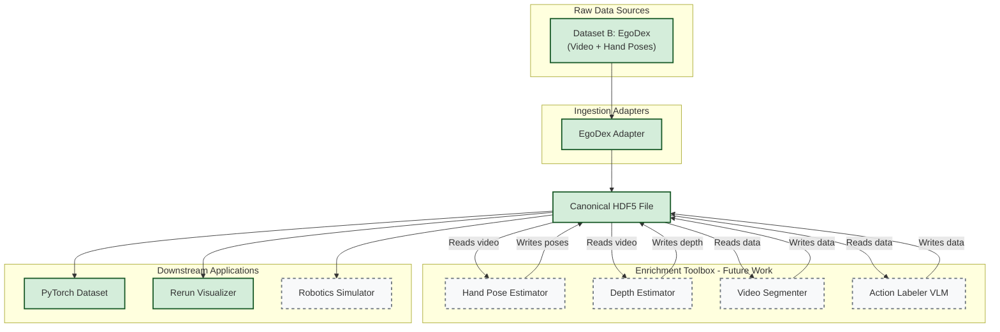

# Egocentric Data Hub (egohub)

An end-to-end Python pipeline for ingesting, normalizing, and serving egocentric datasets for humanoid robotics research in a unified state and action format.

## Core
This project implements a complete pipeline for processing egocentric data, designed for extensibility.

1.  **Ingest (Adapters)**: Raw, heterogeneous egocentric datasets (e.g., EgoDex, HOT3D, Ego4D) are converted into a canonical format using dedicated, class-based **Adapters** that inherit from `egohub.adapters.BaseAdapter`.
2.  **Re-express (Canonical Schema)**: The data is re-expressed into a single, canonical HDF5 format. This schema is multi-camera and multi-modal by design, organizing data by trajectory and then by data stream (e.g., `cameras/{camera_name}/rgb`, `hands/left`).
3.  **Re-serve (Exporters & Datasets)**: The canonical data is consumed by:
    *   A unified `egohub.datasets.EgocentricH5Dataset` for PyTorch.
    *   Modular **Exporters** (inheriting from `egohub.exporters.BaseExporter`) that visualize data in Rerun or prepare it for other applications.

This architecture ensures that adding a new dataset or a new export target only requires adding a new, self-contained Adapter or Exporter class, without modifying the core logic.

## Architectural Diagram


_Completed modules marked in green; future work marked in grey._

## Quick Start

### Prerequisites

- Python 3.9+
- `uv` package manager (`brew install uv` on macOS)

### Installation

```bash
# Clone the repository
git clone <repository-url>
cd egohub

# Set up environment
uv venv
source .venv/bin/activate
uv pip install -e .
```

### Usage Examples

Convert a subset of the EgoDex data to our canonical format and then visualize it with Rerun.

```bash
# 1. Convert EgoDex to canonical HDF5 format using the unified CLI
egohub convert egodex \
    --raw-dir path/to/raw/EgoDex \
    --output-file data/processed/egodex.h5 \
    --num-sequences 10 # Optional: limit for a quick test

# 2. Visualize the canonical HDF5 file
egohub visualize data/processed/egodex.h5 --max-frames 100
```

## Supported Datasets

This table lists the datasets currently supported by `egohub`. We welcome contributions for new adapters! See `CONTRIBUTING.md` for a guide on how to add one.

| Dataset Name | CLI Identifier | Adapter Class | Notes |
| :--- | :--- | :--- | :--- |
| **EgoDex** | `egodex` | `EgoDexAdapter` | Supports video, camera pose, and hand/skeleton poses. |

## Project Structure

```
egohub/
├── egohub/                    # Core, installable library
│   ├── adapters/             # Data ingestion classes (EgoDexAdapter, etc.)
│   │   └── base.py
│   ├── cli/                  # Argparse-based CLI application
│   │   └── main.py
│   ├── datasets.py           # PyTorch dataset classes
│   ├── exporters/            # Data exporting classes (RerunExporter, etc.)
│   │   └── rerun.py
│   ├── schema.py             # Canonical HDF5 schema definition
│   └── transforms/           # Data transformation utilities
│       ├── coordinates.py
│       └── pipeline.py
├── tests/                    # Test suite
└── data/                     # Data storage (gitignored)
    ├── raw/
    └── processed/
```

## Canonical Data Schema

Our canonical HDF5 format is designed to be flexible and extensible, particularly for multi-camera and multi-modal data. All spatial data is transformed into a single **right-handed, Z-up** world coordinate frame.

Each HDF5 file can contain multiple trajectories, identified as `trajectory_{:04d}`. Within each trajectory, data is organized into logical groups:

| Group Path | Description |
| :--- | :--- |
| **`metadata/`** | Contains high-level information about the trajectory, such as `uuid`, `source_dataset`, and a synchronized master `timestamps_ns` dataset. |
| **`cameras/{camera_name}/`** | A group for each camera, where `{camera_name}` is a unique identifier (e.g., `ego_camera_left`, `external_gopro_1`). This is the core of our multi-camera support. |
| **`hands/{left,right}/`** | Contains data related to hand tracking, such as `pose_in_world` and MANO parameters. |
| **`objects/{object_name}/`** | Holds data for tracked objects in the scene, including their `pose_in_world`. |
| **`skeleton/`** | Stores full-body skeleton tracking data, like joint `positions` and `confidences`. |
| **`imu/`** | Placeholder for raw Inertial Measurement Unit data. |
| **`gaze/`** | Placeholder for eye gaze tracking data. |

### Example: Camera Data Structure

Within each `cameras/{camera_name}/` group, the data is further organized. This structure ensures all data associated with a single camera is co-located.

| Path within `cameras/{camera_name}/` | Data Type & Shape | Description |
| :--- | :--- | :--- |
| `pose_in_world` | `float32` (N, 4, 4) | 4x4 pose matrix of this camera in the world frame. |
| `intrinsics` | `float32` (3, 3) | 3x3 pinhole camera intrinsic matrix. |
| `rgb/image_bytes` | `uint8` (N, S) | JPG-encoded RGB image bytes. |
| `depth/image` | `uint16` (N, H, W) | Per-pixel depth images. |

## Coordinate Systems

- **World Frame**: Right-handed, Z-up, Y-forward, X-right (units are in meters).
- **Camera Frame**: Standard OpenCV model (Z-forward, Y-down, X-right).
- **Transformations**: Poses are stored as `T_world_local`, representing the transform from the entity's local frame to the world frame.

## Testing

```bash
# Run all tests
pytest
```


